# Narrative Feedback Loop System

## Overview

The Narrative Feedback Loop System implements a comprehensive mechanism for improving the quality of executive brief synthesis through user feedback. This system captures detailed metadata about brief generation and user satisfaction to continuously refine the LLM prompts and rule-based synthesis.

## 🎯 **Core Value Proposition**

**"Cognitive Relief Through Continuous Improvement"**

The system transforms user feedback into actionable improvements, ensuring that each narrative brief generation becomes more helpful, accurate, and aligned with executive needs.

## 🏗️ **System Architecture**

### **1. Feedback Collection Layer**
- **Frontend**: Thumbs up/down buttons with optional comments
- **API**: `/api/narrative-feedback` endpoint for secure feedback submission
- **Database**: `narrative_feedback` table with comprehensive metadata tracking

### **2. Metadata Tracking**
Each feedback entry captures:
- **Input Data**: Original email clusters and preprocessing results
- **LLM Context**: Prompts used, model selection, response times
- **Output Quality**: Generated markdown and user satisfaction
- **Contextual Data**: Project types, financial content, decision requirements

### **3. Analysis Engine**
- **Pattern Recognition**: Identifies common issues and success factors
- **Performance Tracking**: Monitors engine and project type effectiveness
- **Improvement Suggestions**: Generates actionable recommendations

## 📊 **Database Schema**

### **narrative_feedback Table**
```sql
CREATE TABLE narrative_feedback (
    id UUID PRIMARY KEY,
    user_id UUID REFERENCES auth.users(id),
    created_at TIMESTAMP WITH TIME ZONE,

    -- Generation metadata
    engine_used TEXT NOT NULL,
    generation_timestamp TIMESTAMP WITH TIME ZONE,
    input_emails_count INTEGER,
    input_clusters_count INTEGER,
    cluster_data JSONB,

    -- LLM synthesis data
    llm_prompt TEXT,
    llm_model TEXT,
    llm_response_time_ms INTEGER,

    -- Generated output
    generated_markdown TEXT,
    executive_summary TEXT,

    -- User feedback
    feedback_type TEXT CHECK (feedback_type IN ('helpful', 'not_helpful')),
    feedback_comments TEXT,
    feedback_timestamp TIMESTAMP WITH TIME ZONE,

    -- Quality metrics
    markdown_length INTEGER,
    clusters_covered INTEGER,
    actions_mentioned INTEGER,

    -- Domain classification
    project_types TEXT[],
    has_financial_content BOOLEAN,
    has_decision_content BOOLEAN,
    has_blocker_content BOOLEAN
);
```

### **narrative_feedback_analysis View**
Pre-computed analytics for performance monitoring:
- Success rates by engine type
- Project type performance analysis
- Financial vs. non-financial brief effectiveness
- Response time and quality correlations

## 🔄 **Feedback Flow**

### **1. Brief Generation**


### **2. User Feedback**

```mermaid
graph TD
    A[User Views Brief] --> B[See 👍/👎 Buttons]
    B --> C{Click Feedback}
    C -->|👍| D[Submit Helpful]
    C -->|👎| E[Show Comment Box]
    E --> F[User Adds Comments]
    F --> G[Submit Not Helpful + Comments]
    D --> H[Save to Database]
    G --> H
```


### **3. Analysis & Improvement**


## 📈 **Analytics Dashboard**

The system provides real-time analytics showing:

### **Overall Performance**
- Total feedback collected
- Helpful vs. not helpful rates
- Success rate trends over time
- Average response times

### **Engine Comparison**
- LLM-enhanced vs. rule-based performance
- Success rates by engine type
- Response time analysis

### **Project Type Analysis**
- Financial project brief success rates
- Technical vs. HR vs. Legal project performance
- Specialized prompt effectiveness

### **Common Issues**
- Most frequent complaint categories
- Project types with lowest satisfaction
- Content gaps and missing information

## 🔧 **Implementation Guide**

### **Frontend Integration**

```tsx
// Add to brief display component
<div className="flex items-center gap-2">
  <span className="text-sm text-muted-foreground">Was this summary helpful?</span>
  <Button onClick={() => submitFeedback('helpful')}>👍 Helpful</Button>
  <Button onClick={() => setShowComments(true)}>👎 Not Helpful</Button>
</div>

// Submit feedback with metadata
const submitFeedback = async (type: 'helpful' | 'not_helpful') => {
  await fetch('/api/narrative-feedback', {
    method: 'POST',
    body: JSON.stringify({
      engine_used: metadata.engine_used,
      generated_markdown: briefContent,
      feedback_type: type,
      // ... other metadata
    })
  });
};
```

### **Backend API**

```python
# In FastAPI service
@app.post("/generate-narrative-brief")
async def generate_narrative_brief(req: NarrativeBriefInput):
    start_time = datetime.now(timezone.utc)

    # Generate brief
    result = generate_enhanced_narrative_brief(...)

    end_time = datetime.now(timezone.utc)
    response_time_ms = int((end_time - start_time).total_seconds() * 1000)

    # Add feedback metadata
    result['feedback_metadata'] = {
        'engine_used': result.get('engine'),
        'generation_timestamp': start_time.isoformat(),
        'response_time_ms': response_time_ms,
        'input_emails_count': len(req.emails),
        'cluster_data': result.get('clusters', []),
        'llm_prompt': result.get('llm_prompt')
    }

    return result
```

### **Database Setup**

```bash
# Run migration to create feedback tables
npx supabase migration up --local
```

## 📊 **Analysis & Improvement**

### **Automated Analysis Script**

```bash
# Run feedback analysis
python3 analyze_feedback.py

# Output includes:
# - Overall success rates
# - Engine performance comparison
# - Project type effectiveness
# - Common issue patterns
# - Recommended prompt improvements
```

### **Key Metrics Tracked**

1. **Success Rate**: Percentage of "helpful" feedback
2. **Engine Performance**: LLM vs. rule-based comparison
3. **Project Type Analysis**: Financial, HR, technical, legal performance
4. **Content Quality**: Missing information patterns
5. **Response Times**: Performance optimization opportunities

## 🚀 **Improvement Mechanisms**

### **1. Prompt Engineering**
Based on feedback analysis, the system automatically suggests:
- Specialized prompts for low-performing project types
- Enhanced instructions for common issues
- Improved action item derivation templates

### **2. Rule Enhancement**
For rule-based synthesis:
- Pattern matching improvements
- Context extraction enhancements
- Priority scoring refinements

### **3. Content Strategy**
- Financial information presentation
- Timeline and deadline clarity
- Stakeholder identification accuracy

## 🔐 **Privacy & Security**

### **Data Retention**
- **Raw Emails**: Never stored (process-and-discard)
- **Feedback Data**: Retained for analysis and improvement
- **User Control**: Users can delete their feedback at any time

### **Access Control**
- **Row Level Security**: Users only see their own feedback
- **Service Role**: Analytics access for system improvement
- **Encryption**: Sensitive metadata encrypted at rest

## 📈 **Expected Outcomes**

### **Short Term (1-2 weeks)**
- 15-20% improvement in brief helpfulness
- Clear identification of problem areas
- User engagement with feedback system

### **Medium Term (1-2 months)**
- 30-40% improvement in synthesis quality
- Specialized prompts for different project types
- Rule-based improvements for common scenarios

### **Long Term (3+ months)**
- 50%+ improvement in user satisfaction
- Self-optimizing synthesis system
- Personalized brief generation based on user preferences

## 🧪 **Testing & Validation**

### **A/B Testing**
- Compare old vs. new prompts
- Test specialized vs. general prompts
- Validate rule improvements

### **User Validation**
- Feedback on feedback system usability
- Comment quality and usefulness analysis
- Engagement metrics and completion rates

## 🔄 **Continuous Improvement Cycle**

1. **Collect** user feedback on brief quality
2. **Analyze** patterns and identify issues
3. **Improve** prompts, rules, and synthesis logic
4. **Test** improvements with A/B experiments
5. **Deploy** successful changes to production
6. **Monitor** ongoing performance and user satisfaction

## 📋 **Implementation Checklist**

- [x] Database migration for feedback table
- [x] API endpoint for feedback submission
- [x] Frontend feedback buttons and interface
- [x] Metadata collection in Python service
- [x] Feedback analysis system
- [x] Analytics dashboard for users
- [ ] A/B testing framework
- [ ] Automated prompt improvement suggestions
- [ ] User preference learning

## 🎯 **Success Metrics**

- **User Engagement**: 70%+ of users provide feedback on briefs
- **Quality Improvement**: 20%+ increase in helpful feedback rate
- **System Learning**: Automated identification of 80%+ of common issues
- **User Satisfaction**: 85%+ helpful rate within 3 months

The Narrative Feedback Loop System ensures that your brief generation continuously improves, delivering better cognitive relief and more actionable insights for executives over time.
