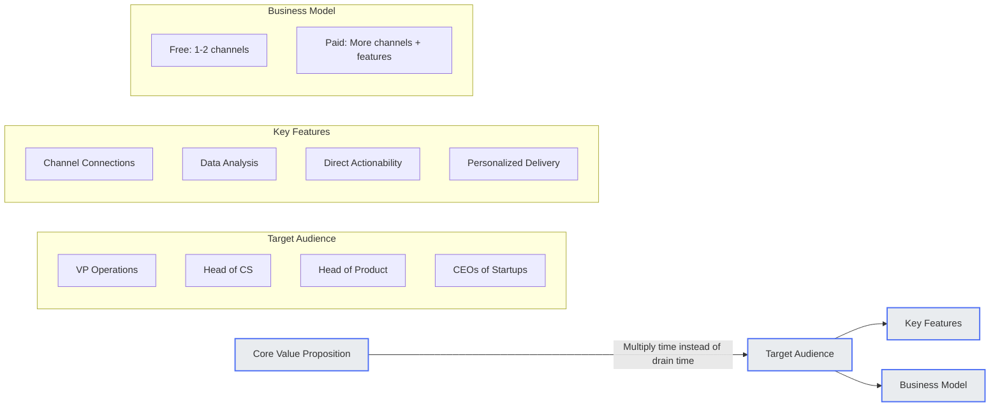
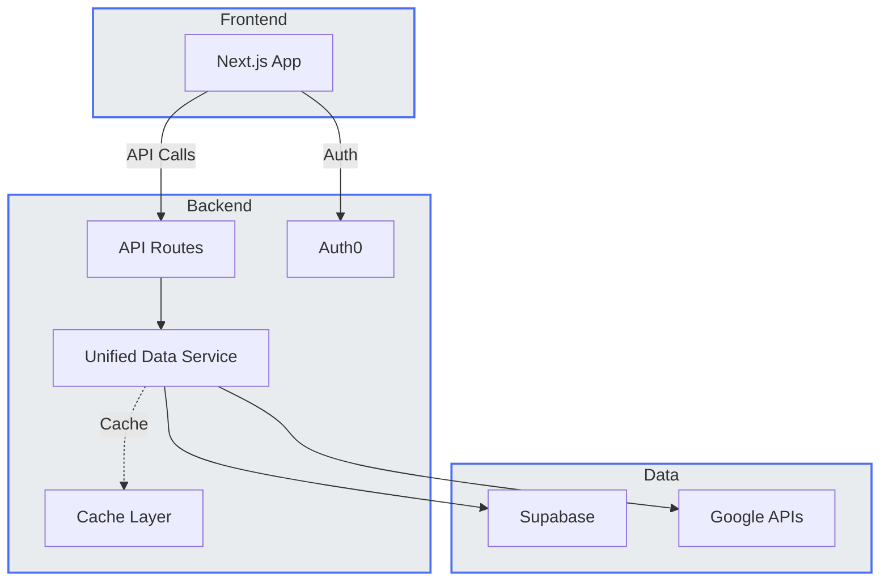
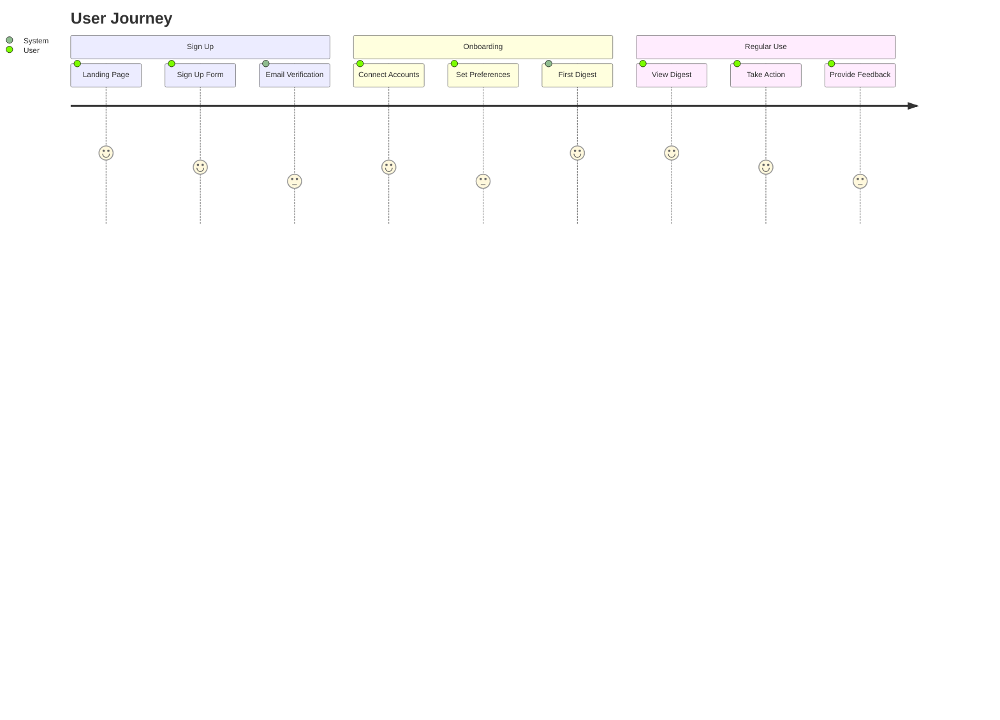
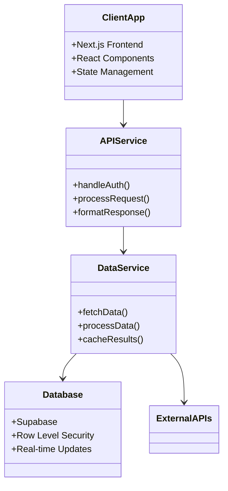

# 360Brief - All Diagrams for Excalidraw

## 1. Core Tenets
```mermaid
graph TD
    A[User-Centric Value Delivery] --> B[Privacy & Security First]
    B --> C[Efficiency & Frugality]
    C --> D[Incremental Value & Phased Rollout]
    D --> E[Maintainability & Modularity]
    E --> F[Actionability & "Signals Over Noise"]
    
    style A fill:#e9ecef,stroke:#4c6ef5,stroke-width:2px
    style B fill:#e9ecef,stroke:#4c6ef5,stroke-width:2px
    style C fill:#e9ecef,stroke:#4c6ef5,stroke-width:2px
    style D fill:#e9ecef,stroke:#4c6ef5,stroke-width:2px
    style E fill:#e9ecef,stroke:#4c6ef5,stroke-width:2px
    style F fill:#e9ecef,stroke:#4c6ef5,stroke-width:2px
```

## 2. Product Vision


## 3. Backend Implementation


## 4. User Flow


## 5. Services Architecture


## How to Use in Excalidraw
1. Go to [Excalidraw](https://excalidraw.com/)
2. Click on the "+" button to create a new drawing
3. Use the "Mermaid to Excalidraw" tool (wrench icon) for each diagram
4. Copy and paste each Mermaid diagram separately
5. Arrange the diagrams on the canvas as needed

Each diagram is separated by headers and uses Mermaid syntax that's compatible with Excalidraw's Mermaid import feature. The diagrams are designed to be visually consistent with a cohesive color scheme and style.
