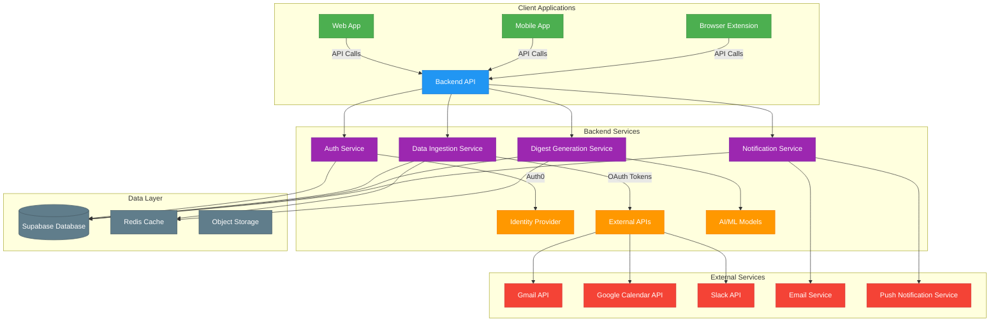

# 360Brief Services Architecture

## Architecture Components

### Client Layer
- **Web App**: Primary interface for users
- **Mobile App**: Native mobile experience (future)
- **Browser Extension**: Quick access and notifications (future)

### Backend Services
- **Auth Service**: Handles authentication and user sessions
- **Data Ingestion Service**: Fetches and processes data from connected sources
- **Digest Generation Service**: Creates personalized digests using AI/ML
- **Notification Service**: Manages delivery of digests and alerts

### Data Layer
- **Supabase Database**: Primary data store for user data and preferences
- **Redis Cache**: Caching layer for improved performance
- **Object Storage**: Stores processed digests and attachments

### External Integrations
- **Identity Provider**: Auth0 for authentication
- **Email & Calendar**: Google APIs for data sources
- **Communication**: Slack API for team integration
- **Delivery**: Email and push notification services

## Data Flow
1. Users authenticate via Auth0
2. OAuth tokens are stored securely in Supabase
3. Data Ingestion Service fetches data from connected sources
4. Processed data is stored in the database
5. Digest Generation Service creates personalized digests
6. Notification Service delivers digests via preferred channels
7. User interactions are captured and used to improve future digests
