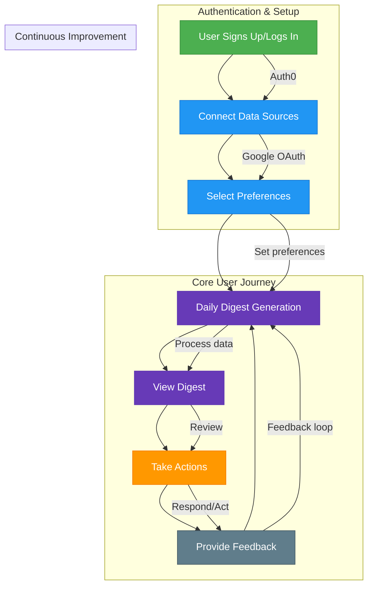

# 360Brief User Flow

## Flow Description
1. **Authentication**: Users sign up/log in via Auth0
2. **Onboarding**: 
   - Connect data sources (Gmail, Calendar, etc.)
   - Set preferences for digest content and delivery
3. **Daily Digest**:
   - System processes connected data sources
   - Generates personalized digest
   - Delivers via preferred channel (web/email/audio)
4. **Interaction**:
   - User reviews digest
   - Takes actions directly from digest (reply, snooze, etc.)
   - Provides feedback to improve future digests
5. **Improvement**:
   - System learns from user feedback
   - Continuously improves digest quality and relevance
