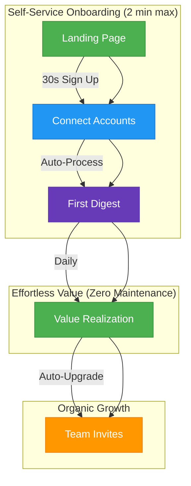

# 360Brief: Frictionless User Journey

## Core User Flow (Time to Value: < 2 minutes)

### 1. Instant Sign Up (30 seconds)
- **Entry Point**: Landing page with clear value prop
- **Action**: Email/password or Google SSO
- **No Credit Card Required**

### 2. One-Click Connections (60 seconds)
- **Auto-Detect**: Available data sources
- **One-Click Connect**: Gmail, Calendar, etc.
- **Permission Granularity**: Request only necessary scopes

### 3. First Digest (Immediate)
- **Instant Processing**: No waiting period
- **Sample Preview**: Show immediate value
- **Zero Configuration**: Smart defaults that work out-of-the-box

### 4. Daily Value (Ongoing)
- **Automatic Updates**: No user action needed
- **Proactive Alerts**: Only when action is required
- **Self-Optimizing**: Gets better with usage

## Key Differentiators

### Zero-Touch Onboarding
- No tutorials needed
- No complex settings
- No training wheels

### Self-Healing System
- Automatic error recovery
- Smart retries for API issues
- Proactive notifications for required actions

### Viral Growth Loops
- Seamless team invites
- Public shareable insights (opt-in)
- Automatic referral tracking

## Technical Foundations

### 1. Error Resilience
- Automatic retries with exponential backoff
- Graceful degradation of non-critical features
- Background synchronization

### 2. Smart Defaults
- Auto-configured based on:
  - User role
  - Industry
  - Connected services

### 3. Proactive Monitoring
- Usage analytics
- Anomaly detection
- Automated health checks

## Success Metrics

### Primary (Focus Areas)
1. **Time to First Value**: < 2 minutes
2. **Activation Rate**: % who connect at least 1 account
3. **Retention**: Daily active users / Weekly active users

### Secondary (Growth Loop)
1. **Viral Coefficient**: Invites per active user
2. **Expansion Revenue**: Upgrades from free to paid
3. **NPS**: Organic advocacy score
